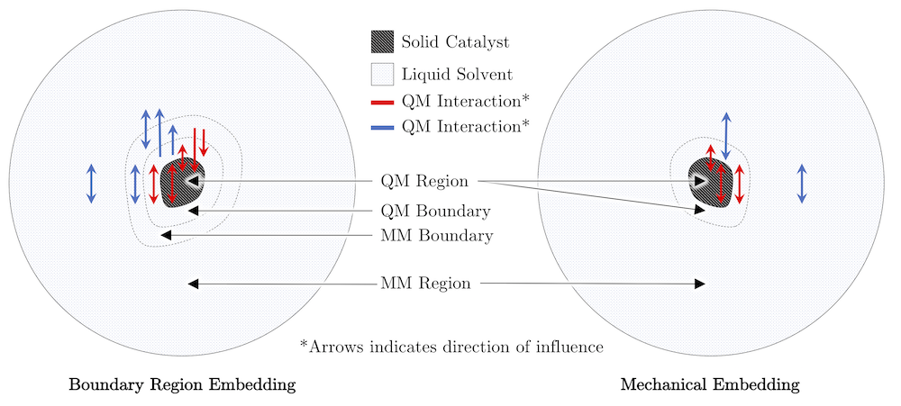

> Goddard Group, Caltech  
> June - August 2017

{:.ioda}

Quantum Mechanics / Molecular Mechanics, or QM/MM, molecular dynamic simulations can help determine the complex and mysterious mechanisms of heterogeneous water-splitting catalysts. QM/MM is well suited for these systems since they are naturally split into a QM region (the catalyst) and an MM region (the solvent). However, conventional methods for describing the critical interactions between the QM and MM regions often fall short. In response, we propose and implement a new methodology: boundary region embedding QM/MM (BREQM). In BREQM, we introduce boundary regions through which the QM and MM regions can influence one another. Compared to conventional QM/MM, BREQM can more easily and consistently model water-splitting catalysts. We believe that mechanistic information gleaned from future BREQM simulations will lead to better water-splitting catalysts. 

> **report:**   
> <a href = "https://wolearyc.github.io/O'Leary_BREQM_Report.pdf" target = "_blank">BREQM: Boundary Region Embedding Quantum Mechanics/Molecular Mechanics</a>   

