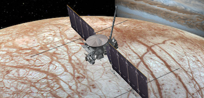

> Laboratory for Reliable Software (LaRS), NASA Jet Propulsion Laboratory  
> June - August 2015

{:.ioda}

LaRS develops and applies novel tools in order to increase the reliability of critical mission software. As a LaRS student researcher, I designed and developed a completely new scalable and user-friendly software analysis platform called C4 for the purpose of automating steps of JPL’s manual code review process. I built C4 around Elasticsearch, a scalable search database, and implemented a query language in order to ask questions about code. For example, C4 could ask “which functions call function foo with what values” and “what functions use global variable bar”. Using my query language, I analyzed the core system software currently running on Mars Science Laboratory – Curiosity as well as the core software to be used on NASA’s upcoming mission to Europa. I presented C4 and my analyses to a group of engineers who wrote the aforementioned software and the members of LaRS; C4 was very well received.
