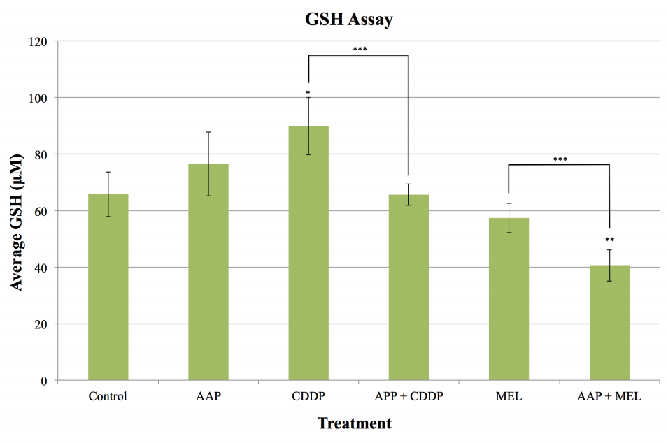

> Muldoon Group, Oregon Health and Science University  
> June - August 2012

{:.ioda}

Carcinoma of the lung affects hundreds of thousands of people every year. Lung adenocarcinoma, the most prevalent type of lung cancer, is commonly treated with the chemotherapies cisplatin (CDDP, platinum based agent) and melphalan (MEL, alkylating agent). However, after repeated treatments, the lung adenocarcinoma can become resistant to the chemotherapy. Research shows that resistant lung adenocarcinoma has increased cellular glutathione (GSH) concentrations, suggesting that GSH may be involved in the mechanism of chemoprotection. Therefore, an agent that decreases GSH concentrations may increase chemotherapy cytotoxicity. In the current study, the efficacy of using high dose acetaminophen (AAP, Tylenol) to decrease cellular GSH concentrations and enhance the cytotoxicity of CDDP and MEL was investigated. AAP was found to significantly decrease GSH concentrations when combined with CDDP compared to treatment with CDDP alone. AAP also decreased GSH concentrations when combined with MEL compared to treatment with MEL alone. The cytotoxicity of the AAP and chemotherapy cocktails was also studied, though the data produced were statistically insignificant. The potential synergistic effect of AAP combined with CDDP or MEL on cellular GSH concentrations suggests further investigation may lead to a novel treatment regimen for chemotherapy­resistant lung adenocarcinoma.
