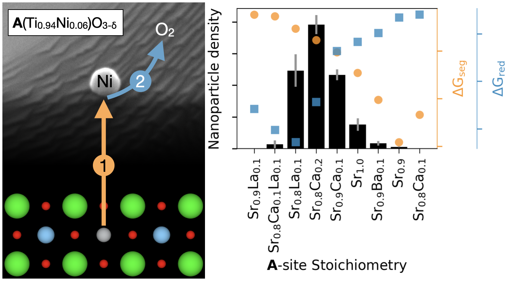
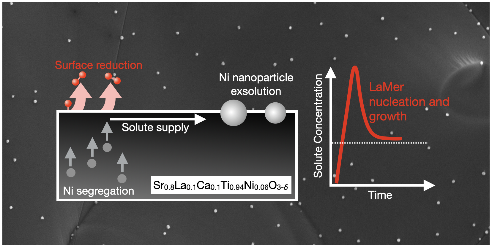

> Rupp Group, MIT & Technical University of Munich  
> June 2020 - June 2023

{:.ioda}

Cermet catalysts formed via exsolution of metal nanoparticles from perovskites promise to perform better in electro- and thermochemical applications than those synthesized by conventional wet-chemical approaches. However, a shortage of robust material design principles still stands in the way of widespread commercial adoption of exsolution. Working with Ni-doped SrTiO3 solid solutions, we investigated how the introduction of Sr deficiency as well as Ca, Ba, and La doping on the Sr site changed the size and surface density of exsolved Ni nanoparticles. We carried out exsolution on 11 different compositions under fixed conditions. We elucidated the effect of A-site defect size/valence on nanoparticle density and size as well as the effect of composition on nanoparticle immersion and ceramic microstructure. Based on our experimental results, we developed a model that quantitatively predicted a composition’s exsolution properties using density functional theory calculations. The model and calculations provide insights into the exsolution mechanism and can be used to find new compositions with high exsolution nanoparticle density.

> **publication:**   
> <a href = "https://pubs.acs.org/doi/10.1021/jacs.2c12011" target = "_blank">Influence of Sr-Site Deficiency, Ca/Ba/La Doping on the Exsolution of Ni from SrTiO3</a>  
>  W. O'Leary, L. Giordano, J. Park, S.S. Nonnenmann, Y. Shao-Horn, J.L.M. Rupp   
> **Journal of the American Chemical Society**, 145, 25, 13768–13779 (2023) 

{:.ioda}

Ceramic-supported metal catalysts formed by exsolution of metal nanoparticles from perovskites are promising materials for energy and chemical conversion applications. However, our incomplete understanding of exsolution mechanism presents a roadblock to engineering exsolution nanoparticle properties. We investigated the influence of reduction conditions on the properties of Ni nanoparticles exsolved on the fracture surfaces of Sr0.8La0.1Ca0.1Ti0.94Ni0.06O3-δ. We first carried out exsolution under 25 different temperatures and oxygen chemical potentials. We found that reduction at lower temperatures and moderate O chemical potentials produced more numerous, smaller nanoparticles. We then fit our data to a LaMer nucleation model where the number of nanoparticles formed depends on Ni surface segregation, reduction of Ni-rich surfaces, and nanoparticle growth. Finally, we demonstrated prediction of the energetics of these processes with density functional theory calculations. Our experiments and modelling build understanding of the exsolution mechanism and are a step towards computational design of supported metal catalysts made via exsolution.

> **publication:**   
> Tuning Reduction Conditions to Understand and Control Ni Exsolution from Sr0.8La0.1Ca0.1Ti0.94Ni0.06O3-δ  
>  W. O'Leary, L. Giordano, J.L.M. Rupp   
> **Journal of Materials Chemistry A**, in press (2023) 
