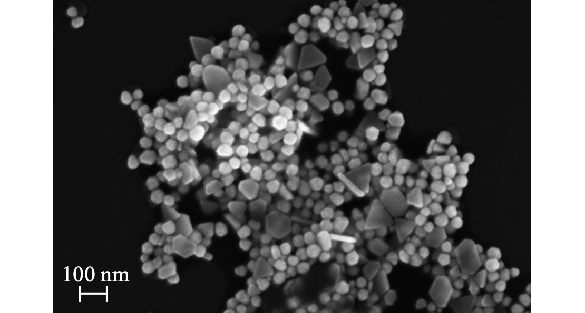

> Caltech  
> January - March 2018

{:.ioda}

Gold nanoparticles (AuNPs) can selectively deliver the bulky, water insoluble photosensitizer drugs central to photodynamic therapy into cancer cells. By exploiting the reducing environment available at a plasma/liquid interface, we synthesized monodisperse 30 nm AuNPs suitable for this application. In preliminary experiments, we found that capping agents were necessary to achieve monodisperse size distributions. Afterwards, we evaluated glucose and citrate as potential capping agents. At excess concentrations, glucose was an effective capping agent, but glucose-capped AuNPs quickly aggregated and precipitated. Citrate was an effective capping agent at lower concentrations, but citrate-capped AuNPs also aggregated and precipitated. In addition, the citrate, rather than the plasma, largely drove reduction processes. Synthesizing AuNPs at a 2:1 ratio of citrate and glucose produced high-quality, 30 nm AuNPs that were remarkably stable at room temperature. Future work will involve screening additional capping agents. With a database linking capping agents to particle size, plasma/liquid interaction syntheses could be utilized to produce AuNPs with specific sizes that are suitable for a variety of drug delivery applications.

> **report:**   
> <a href = "https://wolearyc.github.io/O'Leary_PlasmaNP_Report.pdf" target = "_blank">Glucose- and Citrate-capping in Plasma/Liquid Interaction Gold Nanoparticle Synthesis</a>   

