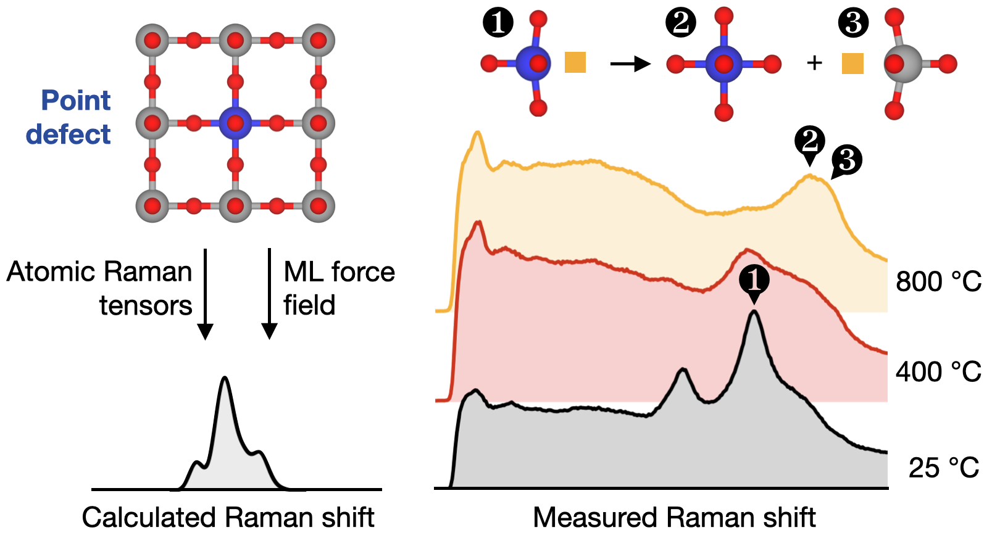

> Rupp Group, MIT & Technical University of Munich  
> September 2021 - June 2024

{:.ioda}

The successful design of solid-state photo- and electrochemical devices depends on the careful engineering of point defects in solid-state ion conductors. Characterization of point defects is critical to these efforts, but the best-developed techniques are difficult and time-consuming. Raman spectroscopy─with its exceptional speed, flexibility, and accessibility─is a promising alternative. Raman signatures arise from point defects due to local symmetry breaking and structural distortions. Unfortunately, the assignment of these signatures is often hampered by a shortage of reference compounds and corresponding reference spectra. This issue can be circumvented by calculation of defect-induced Raman signatures from first principles, but this is computationally demanding. Here, we introduce an efficient computational procedure for the prediction of point defect Raman signatures in solid-state ion conductors. Our method leverages machine-learning force fields and “atomic Raman tensors”, i.e., polarizability fluctuations due to motions of individual atoms. We find that our procedure reduces computational cost by up to 80% compared to existing first-principles frozen-phonon approaches. These efficiency gains enable synergistic computational–experimental investigations, in our case allowing us to precisely interpret the Raman spectra of Sr(Ti0.94Ni0.06)O3-δ, a model oxygen ion conductor. By predicting Raman signatures of specific point defects, we determine the nature of dominant defects and unravel impacts of temperature and quenching on in situ and ex situ Raman spectra. Specifically, our findings reveal the temperature-dependent distribution and association behavior of oxygen vacancies and nickel substitutional defects. Overall, our approach enables rapid Raman-based characterization of point defects to support defect engineering in novel solid-state ion conductors.

> **publication:**   
> <a href = "https://pubs.acs.org/doi/full/10.1021/jacs.4c07812" target = "_blank">Rapid Characterization of Point Defects in Solid-State Ion Conductors Using Raman Spectroscopy, Machine-Learning Force Fields, and Atomic Raman Tensors</a>  
> *W. O’Leary, M. Grumet, W Kaiser, T. Bučko, J.L.M. Rupp, D.A. Egger*
> **Journal of the American Chemical Society**, in press (2023) 

