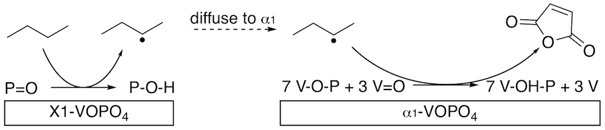

> Goddard Group, Caltech - Pasadena, CA  
> June 2016 - September 2017

{:.ioda}

Logo of *no style, please!* theme[^4]

Industrial production of maleic anhydride (MA) from n-butane relies on the vanadyl pyrophosphate (VPO) catalyst. Improving VPO’s selectivity and activity could have enormous economic and environmental impact, but efforts have been impeded by uncertainties regarding the active phases and atomistic mechanism of the VPO catalyst. We report here a plausible 15-step mechanism taking n-butane to MA with energetics computed using hybrid density functional theory calculations on periodic models of the surface layers. We find that the P=O group on the X1 phase is solely responsible for butane activation. The P=O group is made active by the reduction of a nearby vanadium atom, a so-called reduction-coupled oxo-activation. However, we show that a catalyst consisting only of the X1 phase would not be selective because of several highly exothermic steps. Instead, we show that the more stable α1 phase can catalyze the formation of MA after initial activation, thus proposing and validating a dual-phase mechanism that takes butane to MA. Our new mechanism inspires the development of a more selective VPO catalyst containing small X1 regions highly separated by α1 surfaces.

**publication:**   
Dual-Phase Mechanism for the Catalytic Conversion of n-Butane to Maleic Anhydride by the Vanadyl Pyrophosphate Heterogeneous Catalyst   
 W.C. O’Leary, W.A. Goddard, M. Cheng   
*The Journal of Physical Chemistry C*, 121, 43 24069-24076 (2017) 
